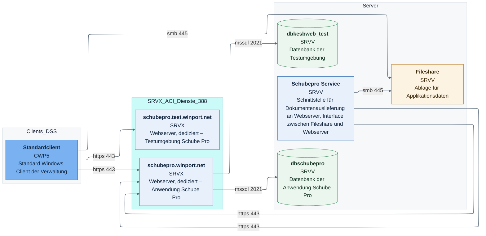

### Architekturdiagramm


```mermaid
%%{init: {"theme":"base","layout":"elk","elk":{"mergeEdges":false,"nodePlacementStrategy":"BRANDES_KOEPF"},"flowchart":{"nodeSpacing":40,"rankSpacing":90,"padding":14},"themeVariables":{"fontFamily":"Segoe UI, system-ui, sans-serif","fontSize":"19px","primaryColor":"#ffffff","primaryBorderColor":"#5b6b7c","lineColor":"#5b6b7c","labelTextColor":"#172033","edgeLabelBackground":"#eee","clusterBkg":"#f6f8fa","clusterBorder":"#c5ced8"},"themeCSS":".nodeLabel,.nodeLabel p,.nodeLabel span{font-size:19px!important}.cluster-label,.cluster-label text,.cluster-label span{font-size:19px!important}.edgeLabel,.edgeLabel p,.edgeLabel span{font-size:19px!important}"}}%%
flowchart LR
  subgraph area0["Clients_DSS"]
    direction TB
    n0_standardclient["<b>Standardclient</b><br/>CWP5<br/>Standard Windows Client der Verwaltung"]
  end
  style area0 fill:#f6f8fa,stroke:#c5ced8,color:#172033
  subgraph area1["SRVX_ACI_Dienste_388"]
    direction TB
    n1_schubepro_winport_net["<b>schubepro.winport.net</b><br/>SRVX<br/>Webserver, dediziert – Anwendung Schube Pro"]
    n3_schubepro_test_winport_net["<b>schubepro.test.winport.net</b><br/>SRVX<br/>Webserver, dediziert – Testumgebung Schube Pro"]
  end
  style area1 fill:#cbfbf8,stroke:#ceb5de,color:#172033
  subgraph area2["Server"]
    direction TB
    n2_schubepro_service["<b>Schubepro Service</b><br/>SRVV<br/>Schnittstelle für Dokumentenauslieferung an Webserver, Interface zwischen Fileshare und Webserver"]
    n4_dbschubepro[("<b>dbschubepro</b><br/>SRVV<br/>Datenbank der Anwendung Schube Pro")]
    n5_dbkesbweb_test[("<b>dbkesbweb_test</b><br/>SRVV<br/>Datenbank der Testumgebung")]
    n6_fileshare["<b>Fileshare</b><br/>SRVV<br/>Ablage für Applikationsdaten"]
  end
  style area2 fill:#f6f8fa,stroke:#c5ced8,color:#172033
  n0_standardclient -->|https 443| n1_schubepro_winport_net
  n0_standardclient -->|https 443| n3_schubepro_test_winport_net
  n0_standardclient -->|smb 445| n6_fileshare
  n1_schubepro_winport_net -->|mssql 2021| n4_dbschubepro
  n1_schubepro_winport_net -->|mssql 2021| n5_dbkesbweb_test
  n2_schubepro_service -->|https 443| n1_schubepro_winport_net
  n2_schubepro_service -->|smb 445| n6_fileshare
  n2_schubepro_service -->|https 443| n1_schubepro_winport_net
  classDef system_0 fill:#79b1f1,stroke:#2f6db5,color:#12263f
  classDef type_WEBSERVER fill:#e8f1fb,stroke:#2f6db5,color:#12263f
  classDef type_DATENBANK fill:#eaf6ee,stroke:#2e7d4f,color:#12301f
  classDef type_FILESHARE fill:#fdf3e3,stroke:#b7791f,color:#3b2a0a
  class n0_standardclient system_0
  class n1_schubepro_winport_net,n2_schubepro_service,n3_schubepro_test_winport_net type_WEBSERVER
  class n4_dbschubepro,n5_dbkesbweb_test type_DATENBANK
  class n6_fileshare type_FILESHARE
  linkStyle default stroke:#5b6b7c,stroke-width:1.5px
```
```mermaid
info
